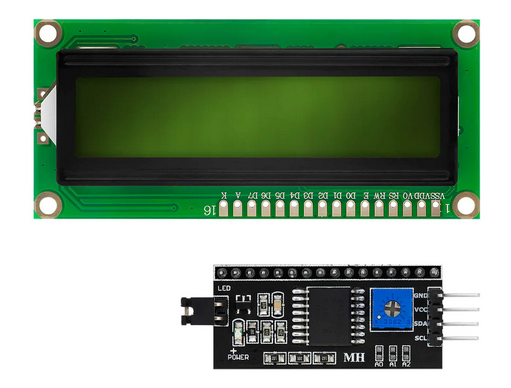

# LCD-I2C

C++ Library for Liquid Crystal Displays (LCD) with the Hitachi HD44780 display driver.
The communication is realized by a PCF8574 remote 8 bit I/O Expander for I²c Bus.

## Contents
* [LCD Documentation](#lcd-documentation)
* [Library Usage](#library-usage)
* [License](#license)
* [Helpful Links](#helpful-links)

## LCD Documentation
### Hitatchi HD44780
The Hitachi HD44780 LCD controller is an alphanumeric dot matrix liquid crystal display (LCD) controller developed by Hitachi in the 1980s. The character set of the controller includes ASCII characters, Japanese Kana characters, and some symbols in two 40 character lines. Using an extension driver, the device can display up to 80 characters. Numerous third-party displays are compatible with its 16-pin interface and instruction set, making it a popular and cheap LCD driver.

In 8-bit mode, all transfers happen in one cycle of the enable pin (E) with all 8 bits on the data bus and the RS and R/W pins stable. In 4-bit mode, data are transferred as pairs of 4-bit "nibbles" on the upper data pins, D7–D4, with two enable pulses and the RS and R/W pins stable. The four most significant bits (7–4) must be written first, followed by the four least significant bits (3–0). The high/low sequence must be completed each time or the controller will not properly receive further commands.

#### Character Generator ROM (CGROM)
The internal CGROM includes 208 characters in a 5x8 dot matrix, and also 32 characters in a 5x10 dot matrix.
The 5x10 matrix is generally not used.

#### Character Generator RAM (CGRAM)
Additionally to the CGROM there is a CGRAM, in which 8 user-defined characters in 5x8 dot matrix, or 4 characters in a 5x10 dot matrix can be stored. 
This enables to store characters which are not available in the CGROM.

A  detailed description of the HD44780 you will find in the [HD44780.pdf](./docs/HD44780.pdf).

### PCF8474 - Remote 8-Bit I/O Expander for I2C Bus
The PCF8574 is an 8-bit input/output (I/O) expander for the two-line
bidirectional bus (I2C) and is designed for 2.5-V to 6-V
VCC operation.

The PCF8574 device provides general-purpose
remote I/O expansion for most microcontroller
families by way of the I2C interface [serial clock
(SCL), serial data (SDA)].

The device features an 8-bit quasi-bidirectional I/O
port (P0–P7), including latched outputs with high-
current drive capability for directly driving LEDs. Each
quasi-bidirectional I/O can be used as an input or
output without the use of a data-direction control
signal. At power on, the I/Os are high. In this mode,
only a current source to VCC is active.

A  detailed description of the PCF8574 you will find in the [pcf8574.pdf](./docs/pcf8574.pdf).

## Library Usage

# License
This library is licensed under MIT Licence.

[LCD-I2C licence](https://github.com/hasenradball/LCD-I2C/blob/master/LICENSE)

# Helpful Links
[Wikipedia - a great description of HD44780 module](https://de.wikipedia.org/wiki/HD44780)

